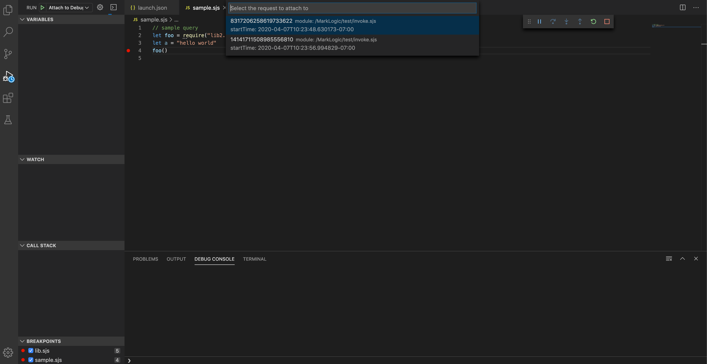

# MarkLogic Developer Tools for Visual Studio Code

The MarkLogic Visual Studio Code extensions allows you to run JavaScript and XQuery (*.sjs, *.mjs, *.xqy) code against a MarkLogic Data Hub or MarkLogic database.
It also adds syntax highlighting for the MarkLogic XQuery dialect  (`version "1.0-ml"`).

## What it does

The extension adds two commands to the VS Code command palette:

1. Evaluate and debug JavaScript
2. Evaluate XQuery (_debugging coming soon_)

## Features

- JavaScript and XQuery code completion with functions from the MarkLogic API
- Readability: Pretty-formatting of query results based on their contents
- Responsiveness: Long-running queries won’t freeze the editor and changes to the configuration take immediate effect so you can switch databases and credentials on-the-fly

## Getting started

Install this tool using the VS Code built-in marketplace. Search "MarkLogic" from the Extension tab of the activity bar. Click “Install” to download and install the extension.

### Configuration

The MarkLogic extension exposes several configuration options from the standard VS Code `settings.json` file (`[Cmd]`-`[,]`),

```json
{
    "marklogic.host": "marklogic-instance.geocities.com",
    "marklogic.port": 8040,
    "marklogic.username": "username",
    "marklogic.password": "****************",
    "marklogic.documentsDb": "myproject-content",
    "marklogic.modulesDb": "myproject-modules"
}
```

You can also set `marklogic.authType` to `DIGEST` or `BASIC`. DIGEST is the default,
and works even if the server is running BASIC authentication.

### Connect and query

To evaluate JavaScript

1. Type a valid JavaScript query in the editor.
2. Open the command palette (<kbd>[Shift]</kbd>+<kbd>[Cmd]</kbd>+<kbd>[P]</kbd>)
3. Select `MarkLogic: Eval JS`

Query results will open in a new document in the current workspace. 

### SSL Configuration

You can turn on SSL with the `marklogic.ssl` configuration property.
If the CA is not in your chain of trust (for example, if the certificate is self-signed),
you need to point to the CA in your configuration as well using `marklogic.pathToCa`.
The configuration will look something like this:

```json
{
    "marklogic.ssl": true,
    "marklogic.pathToCa": "/Users/myself/certs/my.own.ca.crt"
}
```

You can acquire the CA file from the MarkLogic admin pane (usually port 8001), by
going to 'Security' -> 'Certificate Templates' -> (cert host name), and then
selecting the "Status" tab. There is an "download" button in the "certificate template status"
section. Click the "download" button to download a copy of your root CA.

### Per-query configuration override 

You can override your VS Code configured settings by using a block comment as the first language token
in the query. The comment should conform to the following:

- First line includes the string `mlxprs:settings`
- The rest of the comment is valid JSON
- Includes at least one of the following keys: `host`, `port`, `user`, `pwd`, `contentDb`, `modulesDb`, `authType`, `ssl`, `pathToCa`
- The corresponding value should be of the right type for the configuration (number for `port`, boolean for `ssl`, string otherwise)

The values defined in the JSON will override VS Code's MarkLogic client configuration.

For example:

```js
/* mlxprs:settings
{
  "host": "my-test-host",
  "port": 8079,
  "contentDb": "unit-test-database",
  "note": "These settings are for testing only"
}
*/
'use strict';
cts.doc('/my-testing-doc.json');
```

or:

```xquery
(: mlxprs:settings
{
  "host": "my-test-host",
  "contentDb": "unit-test-database",
  "modulesDb": "unit-test-MODULES",
  "user": "unit-tester",
  "pwd": "red,green,refactor",
  "note": "These settings are for testing only"
}
:)
xquery version "1.0-ml";
fn:doc('/my-testing-doc.json')
```

When this query runs, it will use the host, port, and `contentDb` specified in the comment, along with the VS Code configuration parameters for the rest of the MarkLogic client definition. (The "note" will be ignored.) Other queries in other editor tabs will not be affected.

## Debugging JavaScript

The debugger supports two modes of debugging:

1. Launch
2. Attach

Where it can, query debugging uses the same VS Code settings used for running queries (for example, `marklogic.host`, `marklogic.username`).
In addition to these code settings, you will need a **launch config** in your project (under `.vscode/launch.json`) for debug-specific parameters.
Open the `launch.json` from the VS Code command palette with the command: "Debug: Open launch.json".

A typical `launch.json` file looks like this:

```json
{
  "version": "2.0.0",
  "configurations": [
    {
        "request": "launch",
        "type": "ml-jsdebugger",
        "name": "Launch Debug Request"
    },
    {
        "request": "attach",
        "type": "ml-jsdebugger",
        "name": "Attach to Debug Request",
        "path": "Enter the path to local modules root",
        "debugServerName": "Enter debug server name"
    }
  ]
}
```

VS Code is syntax-aware of what information should go into `launch.json`, so take advantage of auto-complete and hover hints as you edit.

### Launch

An example 'launch' type configuration item:

```json
    {
        "type": "ml-jsdebugger",
        "request": "launch",
        "name": "Launch Debug Request"
    }
```

By default, launch mode will launch the currently opened file for debugging.
An optional "path" parameter can be provided to specify another file for debugging.

### Attach

Here's an example of an 'attach' type configuration item:

```json
    {
        "type": "ml-jsdebugger",
        "request": "attach",
        "name": "Attach to Debug Request",
        "debugServerName": "jsdbg",
        "path": "${workspaceFolder}"
    }
```

Attach mode attaches to a paused request in a given *debug server* (an app server connected to js debugger). To make a debug server, open command palette, type `connectServer` and enter an app server name to connect. This will automatically pause all requests to that server so that you can attach the debugger. Use `disconnectServer` disable debugging and resume handling requests as normal.

**Note: Only requests that are launched after a server is connected/made debug server can be attached.**

In attach mode, `debugServerName` and `path` are required. Once you start debugging, a dropdown menu will pop up listing all paused requests on the debug server. Choose the one you want to debug.



Use the optional parameter `rid` to specify a request ID in advance and avoid being prompted for it.

## Notes

### Debugging Limitations

Streaming JavaScript source files from the MarkLogic server is not yet implemented (it's on the roadmap). If you import other modules into your script, you won't be able to inspect or set breakpoints in those files. To work on multiple files in attach mode, you will need a mirror copy of the modules directory on your local machine.

### Required Privileges for eval and debugging

To run queries with the MarkLogic JavaScript and XQuery Debugger, a user will need eval priviliges on your MarkLogic server. These include:

- **xdmp-eval**: absolute minimum
- **xdmp-eval-in**: to use a non-default content database
- **xdmp-eval-modules-change**: to use a non-default modules database or modules root
- **xdmp-eval-modules-change-file**: to use the filesystem for modules

For debugging, a user must also have at least one of these privileges:

- **debug-my-request**: for debugging requests launched by the debug user only
- **debug-any-request**: for debugging requests launched by any user

For more about privileges, see [xdmp:eval] (https://docs.marklogic.com/10.0/xdmp:eval) and [Debug functions](https://docs.marklogic.com/dbg) in the API docs, along with [Pre-defined Executive Privileges](https://docs.marklogic.com/guide/admin/exec_privs) in the MarkLogic server documentation. 

## Credit

Aside from excellent development and extension support from Visual Studio Code,

- Portions of Josh Johnson's [vscode-xml](https://github.com/DotJoshJohnson/vscode-xml) project are re-used
for XML formatting. The MIT license and source code are kept in the `client/xmlFormatting` folder of this project.
- Christy Haragan's [marklogic-node-typescript-definitions](https://github.com/christyharagan/ml-typescript-definitions)
made this project possible.
- Paxton Hare's [marklogic-sublime](https://github.com/paxtonhare/MarkLogic-Sublime)
`xquery-ml.tmLanguage` code is used for XQuery-ML syntax and snippets, and the MarkLogic Sublime project inspired this one.
