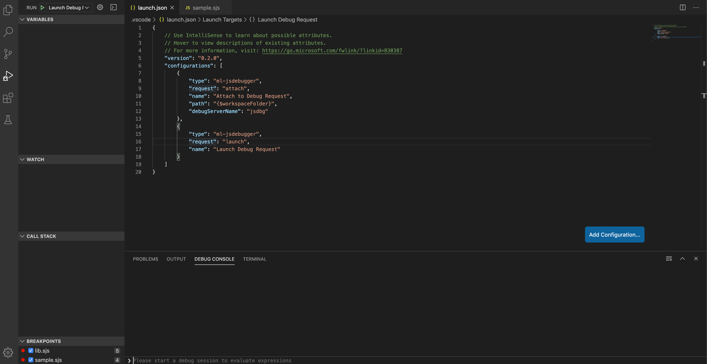

# ml-jsdebugger

This add-on supports debugging javascript request running in MarkLogic server. 

The debugger supports two modes of debugging:

1. Launch
2. Attach

Configuration for these two modes differs slightly, and is documented below.

## Configuration

Where it can, query debugging uses the same VS Code settings that are used for running queries (e.g. `marklogic.host`, `marklogic.username`). You'll also need a launch config in your project (under `.vscode/launch.json`) that specifies debug-specific parameters.



### Launch

Example config:

```json
    {
        "type": "ml-jsdebugger",
        "request": "launch",
        "name": "Launch Debug Request"
    }
```
Launch mode will launch the currently opened file for debugging by default.
An optional "path" parameter can be provided to specify another file for debugging.

### Attach

Example config:

```json
    {
        "type": "ml-jsdebugger",
        "request": "attach",
        "name": "Attach to Debug Request",
        "debugServerName": "jsdbg",
        "path": "${workspaceFolder}"
    }
```

Attach mode attaches to a paused request in a *debug server*. A debug server is an app server that is connected to js debugger.
To make a debug server, open command palette, type connectServer and enter an app server name to connect. Type disconnectServer if you no longer 
need the debug server.
**Only requests that are launched after a server is connected/made debug server can be attached.**

In attach mode, `debugServerName` and `path` are required. Once you start debugging,
a dropdown menu will pop up listing all paused requests on the debug server. Choose the one you want to debug.

There is one optional parameter: `rid`. You can use this if you already know the request ID and don't want to be prompted for it.


## Required priviledges

To use the debugger, a debug user may need following priviledges and more:

| Name | Action URI |
|---|---|
| xdmp-eval | *http://marklogic.com/xdmp/privileges/xdmp-eval* |
| debug-my-request | *http://marklogic.com/xdmp/privileges/debug-my-request* |
| debug-any-request | *http://marklogic.com/xdmp/privileges/debug-any-request* |
| xdmp-eval-in | *http://marklogic.com/xdmp/privileges/xdmp-eval-in* | 
| xdmp-eval-modules-change | *http://marklogic.com/xdmp/privileges/xdmp-eval-modules-change* |
| xdmp-eval-modules-change-file | *http://marklogic.com/xdmp/privileges/xdmp-eval-modules-change-file* | 

Note: *http://marklogic.com/xdmp/privileges/debug-my-request* allows debugging requests launched by the debug user only. *http://marklogic.com/xdmp/privileges/debug-any-request* allows debugging requests launched by any user. A debug user must have at least one of these two priviledges.

## Coming soon

We have not implemented streaming files currently, so if you import other modules in your script, you won't be able to inspect, set breakpoints in those files. You will only be able to work on multiple files in attach mode when you have a mirror copy of the modules directory on your local machine. This limitation will hopefully be addressed soon.
